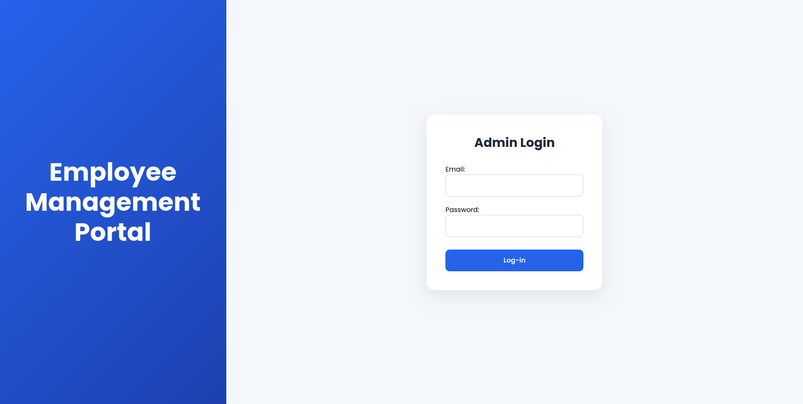
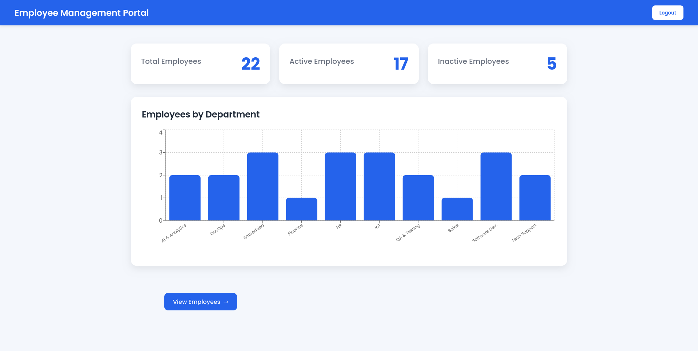
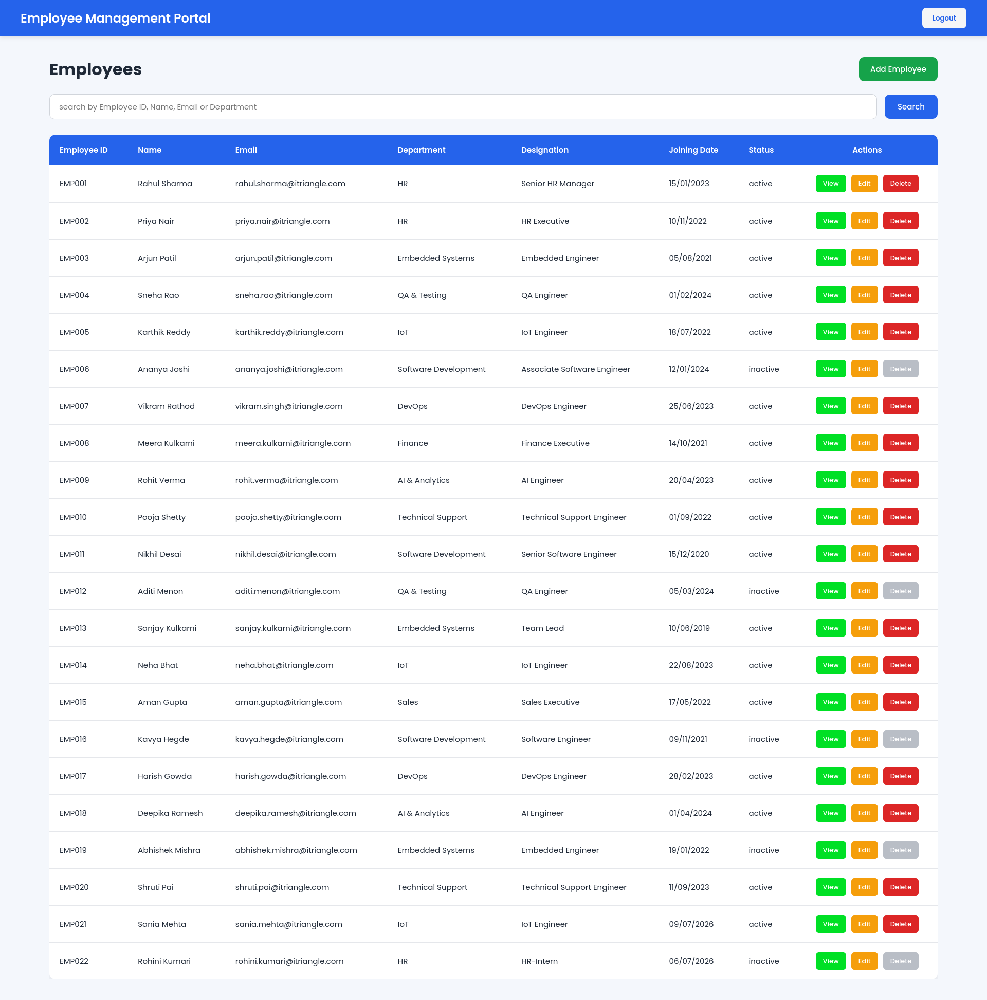
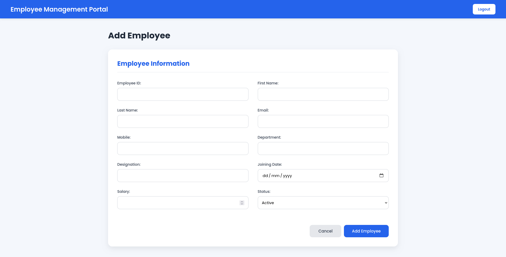
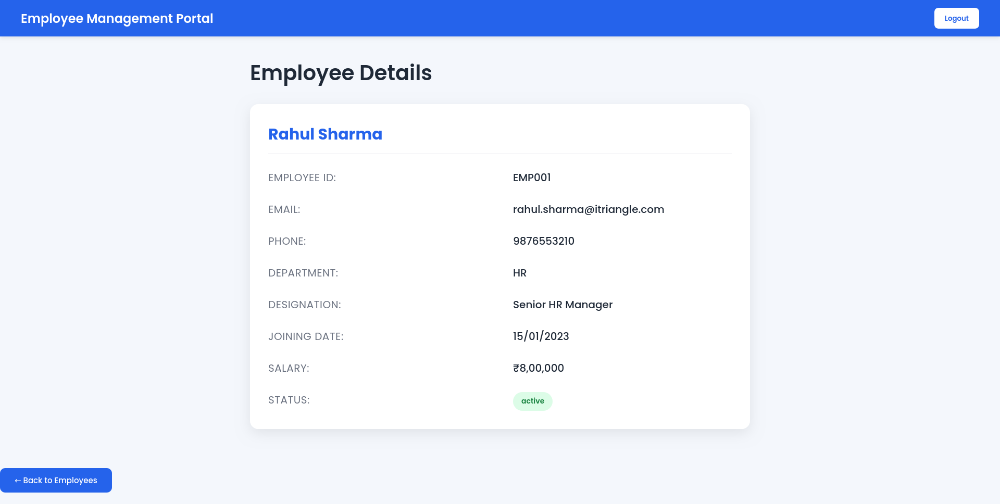
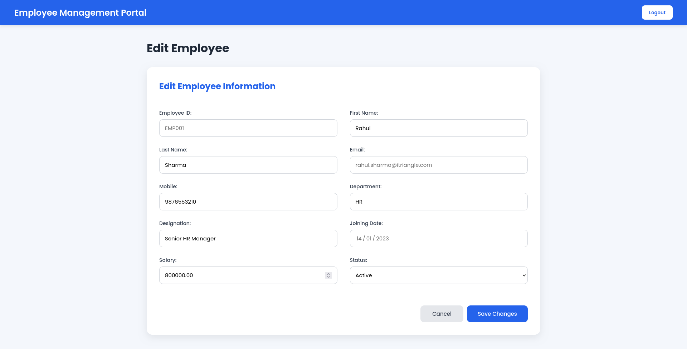

# 👨‍💼 Employee Management Portal

A full-stack **Employee Management Portal** built using the **PERN Stack (PostgreSQL, Express.js, React.js, and Node.js)**. This project was developed during my internship to gain hands-on experience with full-stack development, REST APIs, authentication, database management, and responsive UI design.

> **Project Status:** ✅ Completed

---
## Screenshots
<table>
  <tr>
    <td></td>
    <td></td>
    <td></td>
  </tr>
  <tr>
    <td></td>
    <td></td>
    <td></td>
  </tr>
</table>

---

# ✨ Features

### 🔐 Authentication
- Secure Admin Login
- JWT Authentication
- Protected Routes
- Session Management using Local Storage

### 👥 Employee Management
- View Employee List
- Add New Employee
- Edit Employee Details
- Soft Delete Employee (Status changed to Inactive)
- View Employee Profile
- Employee Search (Name, Email, Department)

### 📊 Dashboard
- Employee Statistics Cards
  - Total Employees
  - Active Employees
  - Inactive Employees
- Department-wise Employee Distribution (Bar Chart)

### 📱 Responsive Design
- Mobile-Friendly Layout
- Responsive Navigation
- Responsive Forms
- Responsive Dashboard
- Responsive Employee Table

---

# 🛠 Tech Stack

## Frontend
- React.js
- React Router DOM
- Axios
- Recharts
- CSS3

## Backend
- Node.js
- Express.js
- JWT
- bcrypt

## Database
- PostgreSQL

## API Testing
- Postman

## Tools
- Git
- GitHub
- VS Code

---

# 📂 Project Structure

```text
Employee-Portal/
│
├── Frontend/
│   ├── src/
│   │   ├── components/
│   │   ├── pages/
│   │   ├── services/
│   │   ├── assets/
│   │   ├── App.jsx
│   │   └── main.jsx
│   └── package.json
│
├── Backend/
│   ├── config/
│   ├── controllers/
│   ├── middleware/
│   ├── models/
│   ├── routes/
│   ├── Server.js
│   ├── package.json
│   └── .env
│
├── database/
│   └── schema.sql
│
├── postman/
│   └── Employee-Portal.postman_collection.json
│
├── README.md
└── .gitignore
```

---

# 📸 Application Modules

- 🔐 Login
- 📊 Dashboard
- 👥 Employee List
- ➕ Add Employee
- ✏️ Edit Employee
- 👤 Employee Details
- 🔍 Search Employees
- ❌ Soft Delete Employee

---

# 🚀 Getting Started

## Clone Repository

```bash
git clone https://github.com/Shreya-RN/Employee-Portal.git
cd Employee-Portal
```

---

## Backend

```bash
cd Backend
npm install
node Server.js
```

---

## Frontend

```bash
cd Frontend
npm install
npm run dev
```

---

## Database Setup

1. Install PostgreSQL
2. Create a database

```sql
CREATE DATABASE employee_portal;
```

3. Execute

- Replace YOUR_PASSWORD with actual password in Backend/hashPassword.js
- Replace YOUR_BCRYPT_HASH with the generated hash in Database/schema.sql

```
Database/schema.sql
```

4. Configure the `.env` file.

---

# 🔑 Environment Variables

Create a `.env` file inside **Backend/**

```env
PORT=5000

DB_HOST=localhost
DB_PORT=5432
DB_NAME=employee_portal
DB_USER=postgres
DB_PASSWORD=your_password

JWT_SECRET=your_secret_key
```

---

# 📡 REST API Endpoints

| Method | Endpoint | Description |
|---------|----------|-------------|
| POST | `/login` | Admin Login |
| GET | `/dashboard` | Dashboard Statistics |
| GET | `/dashboard/departments` | Department Statistics |
| GET | `/employees` | Get All Employees |
| GET | `/employees/:employeeId` | View Employee |
| GET | `/employees/search` | Search Employees |
| POST | `/employees` | Add Employee |
| PUT | `/employees/:employeeId` | Edit Employee |
| PUT | `/employees/:employeeId/delete` | Soft Delete Employee |

---

# 📈 Dashboard Analytics

The dashboard includes:

- Total Employees
- Active Employees
- Inactive Employees
- Department-wise Employee Distribution using Recharts

---

# 📚 What I Learned

- JWT Authentication
- Protected Routes
- REST API Development
- PostgreSQL CRUD Operations
- React State Management
- React Router
- Axios API Integration
- Responsive UI Design
- Recharts Data Visualization
- Backend Architecture (MVC)
- Git & GitHub Workflow
- Postman API Testing

---

# 🔮 Future Enhancements

- Pagination
- Sorting & Advanced Filters
- Employee Profile Picture Upload
- Export Employees to Excel/PDF
- Role-Based Authentication
- Dark Mode
- Dashboard Analytics Expansion

---

# 👩‍💻 Author

**Shreya Nayak**

B.Tech Computer Science & Engineering  
Presidency University, Bengaluru

- GitHub: https://github.com/Shreya-RN
- LinkedIn: https://linkedin.com/in/shreya-nayak-srn

---

# 📄 License

This project was developed as part of my internship for learning and educational purposes.
